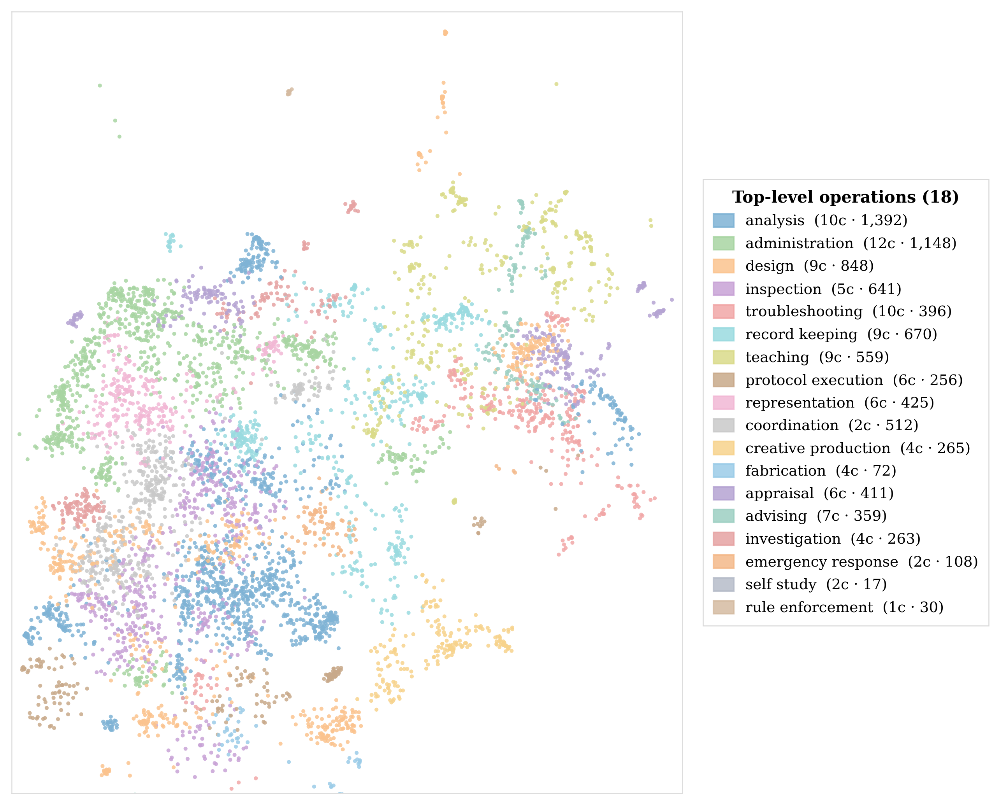
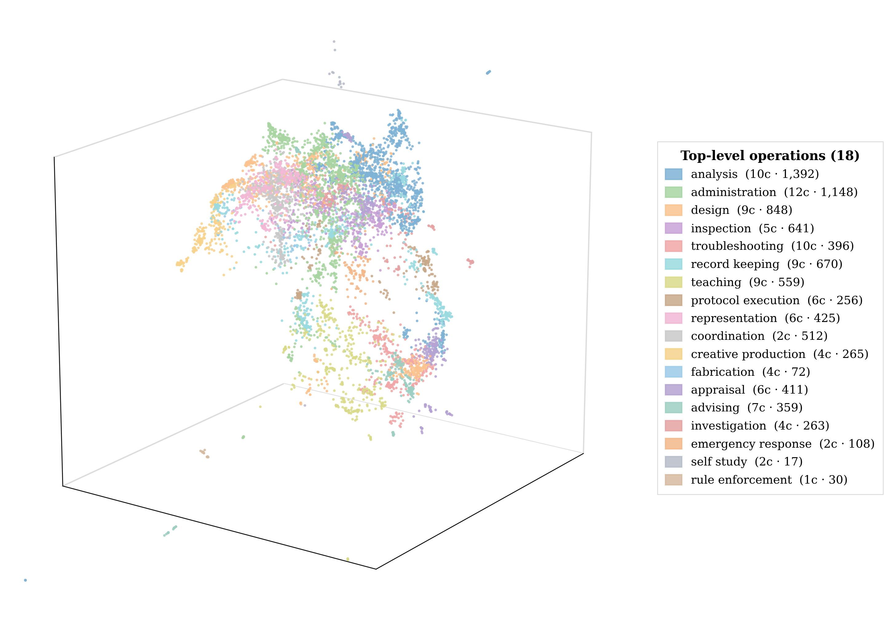
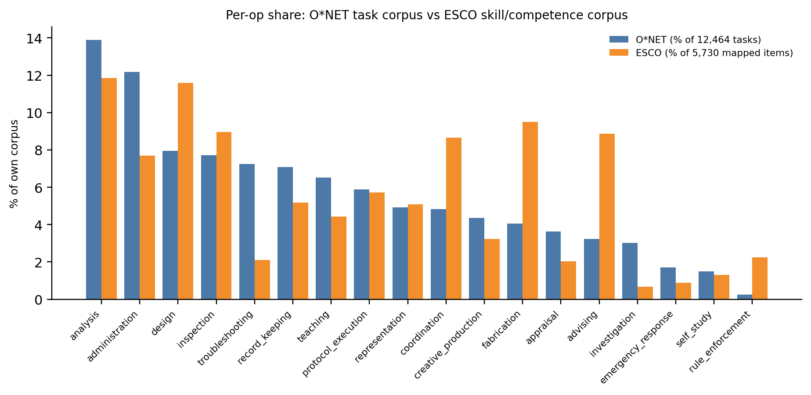

# From Scores to Knowledge Work: Rethinking AI Agent Evaluation

Public repository for the NeurIPS 2026 position-track paper *From
Scores to Knowledge Work: Rethinking AI Agent Evaluation*.

**Authors.** Yining Hua (Harvard), Hongbin Na (UTS), Cyrus Ayubcha
(Harvard), Levi Lian (Stanford / Raycaster AI; corresponding author).

The paper PDF is [`main.pdf`](main.pdf); the LaTeX source is
[`main.tex`](main.tex). Reproduction code is in
[`scripts/`](scripts/), derived analysis artefacts are in
[`data/`](data/), and supplementary documentation is in
[`docs/`](docs/).

## What this paper argues

AI agents are routinely evaluated as if high scores on public
benchmarks demonstrate readiness for knowledge work such as drafting,
analysis, audit, troubleshooting, and clinical administration. The
benchmark layer instead scores primitives (retrieval, classification,
short-answer reasoning, exact-match patches), which under-determine
whether an output can be acted on inside a real workflow. The
position is that knowledge work should be evaluated on
*operations*, the smallest activity patterns that recur across
occupations and carry a recognizable professional construct, and that
primitive scores should not be cited as evidence of deployable
knowledge-work capability unless the evaluation establishes both
operation coverage and output validity.

The paper supports this position in three steps:

1. A two-layer validity account for knowledge-work outputs. Task
   validity (grounding, boundedness, handoff) and organizational
   validity (authorized use, locatable accountability,
   integrability) are independent and jointly necessary.
2. An empirically derived 18-operation taxonomy of knowledge-work
   operations, built from O\*NET 30.2 task statements and validated
   against the ESCO v1.1.1 skill/competence catalog.
3. An audit of three frontier suites (GDPval, $\tau^2$-Bench,
   APEX-Agents) against a 5-condition strict-cover rule and against
   the four validity criteria. Three partial covers; zero strict
   covers.

A central diagnostic is the distinction between *knowledge work*
(the superset, defined by knowledge as raw material and product
plus non-routine judgment) and *professional work* (the strict
subset gated by formal credentialing, exclusive jurisdiction,
sign-off authority, and personal liability). AI capability claims
are routinely stated in professional-work language and supported by
knowledge-work-content benchmarks that do not exercise
credentialing, sign-off, or liability.

## The 18 operations

| operation | tasks | one-line definition |
| --- | ---: | --- |
| `analysis` | 1,732 | Evidence → findings / interpretation. |
| `administration` | 1,517 | Run HR / finance / procurement / operations. |
| `design` | 992 | Specify a new system / plan / service. |
| `inspection` | 963 | Present-state compliance check against rules or specs. |
| `troubleshooting` | 902 | Diagnose a malfunction and apply a remediation. |
| `record_keeping` | 882 | Produce, store, retrieve records (the retrieval / RAG analogue). |
| `teaching` | 814 | Transfer skill / knowledge to learners. |
| `protocol_execution` | 735 | Follow a prescribed, safety-critical procedure exactly. |
| `representation` | 615 | Engage externals on behalf of the organization. |
| `coordination` | 603 | Align internal parties on a shared task. |
| `creative_production` | 543 | Original creative / media output. |
| `fabrication` | 505 | Physically make, install, or maintain tangible assets. |
| `appraisal` | 453 | Score / grade / value a submission on a rubric. |
| `advising` | 403 | 1:1 personalized recommendation to a client. |
| `investigation` | 377 | Reconstruct a past event or uncover wrongdoing. |
| `emergency_response` | 212 | Stabilize an acute crisis. |
| `self_study` | 186 | Keep one's own professional competency current. |
| `rule_enforcement` | 30 | Set and uphold behavioral rules in a setting. |

Counts sum to 12,464, the full Job-Zone-3 to Job-Zone-5 corpus of
O\*NET 30.2 occupation-specific task statements covered by the 18
operations via cluster soft-assignment. A stabilized round-2
knowledge-work screen retains 8,372 of these for the operation
atlas (the figure below), so per-operation counts in that subset
are smaller than the totals shown here. Operation specifications
carry `input`, `output`, `distinct_from`, and at least three
profession families in `cross_job_examples`; full specifications
are in `data/derived/manual_labeling/operation_taxonomy.json`.

## Figures

### Operation atlas (2D)

UMAP projection of the 8,372 retained O\*NET tasks colored by
operation. The largest operations occupy multiple disjoint regions
because their constituent tasks come from different occupations yet
share the same underlying abstraction.



### Operation atlas (3D, supplementary)

3D UMAP layout of the same retained tasks, useful for separating
operations that overlap in 2D.



An interactive HTML version is at
[`docs/figures/operation_atlas.html`](docs/figures/operation_atlas.html).
Clone the repository to view it locally, or render it directly through
GitHub's HTML preview:

- [Interactive 3D atlas (htmlpreview.github.io)](https://htmlpreview.github.io/?https://github.com/7th-ave-labs/knowledge-work-benchmark/blob/main/docs/figures/operation_atlas.html)

### O\*NET vs ESCO per-operation share

Side-by-side comparison of operation share in the two corpora,
holding the 18 labels fixed. Every operation is populated in both
corpora; the re-weighting tracks a construction-level difference
(O\*NET is per-occupation, ESCO is competence-indexed).



### Pipeline (clustering and consolidation)

The construction pipeline from raw O\*NET tasks to the 18
operations is documented in Appendix A of the paper; the diagram
appears as Figure A.1 inside `main.pdf`.

## Audit summary (Section 5 of the paper)

| suite | coverage verdict | validity gap |
| --- | --- | --- |
| GDPval | partial cover at corpus, primitive at per-task | grounding partly tested via human reference; boundedness untested; handoff does not test admissibility, sign-off, or liability |
| $\tau^2$-Bench | partial cover, single domain (customer service) | grounding enforced via policy/state; boundedness as script compliance; handoff terminates inside the simulator |
| APEX-Agents | partial cover, three professional-services jobs (lawyer, consultant, banker) | grounding structurally exercised via curated worlds; boundedness via task scope; handoff partially tested via expert rubric; institutional layer (sign-off, filing, liability) not exercised |

Roll-up: three partial covers, zero strict covers. Most of the 18
operations have no analogue in this audited sample.

## Build the PDF

```
pdflatex main
bibtex   main
pdflatex main
pdflatex main
```

Output: `main.pdf`. The build uses the local `neurips_2026.sty` and
standard TeX Live packages (`graphicx`, `booktabs`, `tabularx`,
`amsfonts`, `microtype`, `hyperref`, `natbib` with numeric
citations).

## Repository layout

```
knowledge-work-benchmark/
├── main.tex                   manuscript (NeurIPS 2026 position track)
├── main.pdf                   compiled paper
├── references.bib             bibliography
├── neurips_2026.sty           NeurIPS 2026 position-track style
├── mapping_tables.tex         appendix-side operation mapping tables
├── operation_atlas.png        Figure B.1 (2D atlas, main body reference)
├── esco_onet_op_share.png     Figure C.1 (O*NET vs ESCO share)
├── esco_atlas_2d.png          supplementary 2D atlas
├── data/                      raw inputs and derived analysis artefacts
├── scripts/                   reproduction pipeline (O*NET + ESCO)
├── docs/                      codebook, audit notes, figures, freeze logs
├── requirements.txt           Python dependencies
├── CITATION.cff               GitHub citation metadata
├── LICENSE                    Apache License 2.0
└── data/NOTICE                third-party data attribution (O*NET, ESCO)
```

Large embeddings (`data/derived/embeddings/`, ~89 MB of `.npz` task
embeddings) are not committed; they are regenerated by
`scripts/embed_onet_tasks.py` from `data/raw/onet/` (see *Reproduction
pipeline* below).

## Source data

* **O\*NET 30.2** task statements, occupation data, job zones, and
  task ratings, retrieved by `scripts/download_onet_core.sh` into
  `data/raw/onet/`.
* **ESCO v1.1.1 (English CSV)**, retrieved by
  `scripts/esco/download_esco.sh` into `data/raw/esco/` (not
  committed; recovered by the script). The Skills, Occupations, and
  occupation-skill relations CSVs are ingested. ISCO major groups
  1-3 define the knowledge-work scope.

## Reproduction pipeline

| stage | script | output |
| --- | --- | --- |
| ingest O\*NET | `scripts/prepare_onet_tasks.py` | `data/derived/onet_tasks_prepared.parquet` |
| screen tasks | `scripts/round2_knowledge_screen.py` | `data/derived/task_operations_normalized_round2.parquet` (8,372 retained) |
| embed | `scripts/embed_onet_tasks.py` | `data/derived/embeddings/onet_task_embeddings__task_only.npz` (1,536-d) |
| cluster | `scripts/build_operation_hierarchy.py` | 108 dense HDBSCAN groups |
| consolidate | `scripts/consolidate_work_patterns.py` then `scripts/finalize_work_patterns.py` | `data/derived/manual_labeling/operation_taxonomy.json` (18 operations, frozen) |
| atlas | `scripts/build_operation_atlas.py` | `operation_atlas.png` |
| ESCO scope filter | `scripts/esco/prepare_esco_items.py` | `data/derived/esco/esco_items_scoped.parquet` (5,826 items) |
| ESCO embed | `scripts/esco/embed_esco_items.py` | `data/derived/esco/esco_*_embeddings.npz` |
| ESCO cluster | `scripts/esco/cluster_esco_items.py` | `data/derived/esco/esco_hdbscan_clusters.parquet` |
| ESCO assign | `scripts/esco/map_esco_to_ops.py` | `data/derived/esco/esco_op_assignments.parquet` |
| ESCO coverage | `scripts/esco/build_esco_coverage.py` | `data/derived/esco/esco_coverage_by_op.csv` |
| ESCO atlas | `scripts/esco/build_esco_atlas.py` | `esco_onet_op_share.png` |

`data/derived/esco/README.md` documents freeze metadata for the
ESCO study (versions, seeds, embedding model, LLM model, HDBSCAN
parameters).

## Models and seeds

| component | value |
| --- | --- |
| embedding model | `text-embedding-3-small` (OpenAI), 1,536-d, $L_2$-normalized |
| LLM (operation assignment) | `gpt-5.4-mini` at temperature 0, JSON schema output |
| HDBSCAN | `min_cluster_size = 40`, `min_samples = 10` |
| UMAP | 15-d cosine reduction, `n_neighbors = 30`, seed 42 |
| LLM cache | append-only `esco_llm_cache.jsonl` (resumable) |
| taxonomy reference | `data/derived/manual_labeling/operation_taxonomy.json` (post-merge: `assistance -> protocol_execution`) |
| freeze date | 2026-04-22 (see `docs/freeze_log/`) |

## Python environment

```
python -m venv .venv
source .venv/bin/activate
pip install -r requirements.txt
```

The pipeline expects `OPENAI_API_KEY` for embedding and assignment
calls.

## Citation

If you use this paper, the operation taxonomy, or the audit, please
cite:

```bibtex
@inproceedings{hua2026scores,
  title     = {From Scores to Knowledge Work: Rethinking AI Agent Evaluation},
  author    = {Hua, Yining and Na, Hongbin and Ayubcha, Cyrus and Lian, Levi},
  booktitle = {NeurIPS 2026 Position Paper Track},
  year      = {2026}
}
```

GitHub also picks up [`CITATION.cff`](CITATION.cff) for the *Cite
this repository* button.

## Editorial conventions used in the paper

* Author-year parenthetical citations ([Author, Year]) per the NeurIPS 2026 position-paper style.
* Main-body figures and tables are numbered sequentially (Table 1).
* Appendix figures and tables are numbered with the appendix
  letter prefix (Figure A.1, Figure B.1, Table D.1, etc.).
* All file paths, script names, and reproduction commands live in
  this README, not in the paper.

## License

Code and derived artefacts in this repository are released under the
[Apache License 2.0](LICENSE).

The paper text and figures are released under the same license; if you
redistribute the manuscript, please retain author attribution.

Third-party occupational data (O\*NET 30.2, ESCO v1.1.1) carry their
own licenses and attribution requirements. See [`data/NOTICE`](data/NOTICE).
